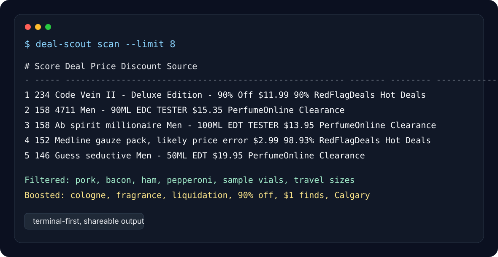
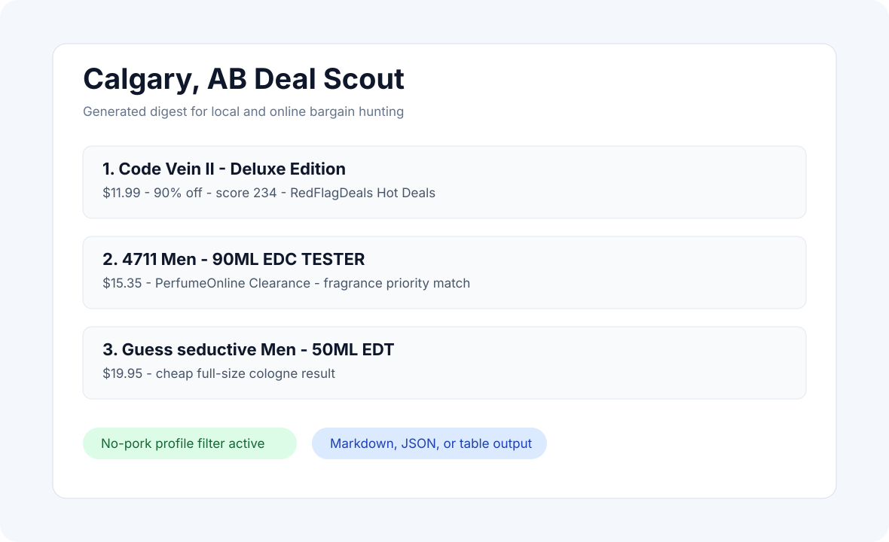

# Deal Scout

**Personal deal intelligence for people who want the weird good stuff before it disappears.**


Deal Scout scans local and online deal sources, removes things you do not want,
scores the strongest finds, and prints a clean digest you can share.

It started with a Calgary profile for fragrance, liquidation, 90%-off finds,
and cheap essentials. The default profile also blocks pork-related grocery
items so the digest does not recommend food you will not buy.



## Why This Exists

Most price trackers are built around products you already know you want. Deal
Scout is for discovery:

- "Show me anything unusually cheap around Calgary."
- "Prioritize cologne and fragrance deals."
- "Surface 90%-off or price-error posts."
- "Filter out categories I never want."
- "Give me a digest I can send to someone."

## Highlights

- **Source adapters:** RedFlagDeals Atom, Reddit JSON, merchant pages.
- **Deal scoring:** boosts for 90% off, cologne/fragrance, liquidation, cheap
  items, local Calgary terms, coupons, and free shipping.
- **Personal filters:** block keywords globally or per source.
- **Variant extraction:** merchant pages can follow product links and extract
  sizes/testers separately.
- **Shareable output:** terminal table, Markdown digest, or JSON.
- **Small surface area:** plain Python package, YAML config, pytest tests.

## Quick Start

```bash
git clone https://github.com/mizoz/deal-scout.git
cd deal-scout
python3 -m venv .venv
. .venv/bin/activate
pip install -e ".[dev]"
deal-scout doctor
deal-scout scan --limit 15
```

Without installing:

```bash
PYTHONPATH=src python3 -m deal_scout.cli scan --config configs/calgary.yaml
```

## Commands

```bash
deal-scout scan
deal-scout scan --format markdown --output deals.md
deal-scout scan --format json --output deals.json
deal-scout scan --include fragrance --include tester
deal-scout scan --min-score 120 --limit 10
deal-scout sources
deal-scout doctor
```

## Screenshots

### Terminal Digest


### Shareable Markdown



## Repo Map

```text
configs/              Ready-to-edit profiles
docs/                 Configuration and source guides
examples/             Sample generated outputs
src/deal_scout/       CLI, scanner, scoring, sources, renderers
tests/                Unit tests
```

## Configuration

The Calgary profile lives at [configs/calgary.yaml](configs/calgary.yaml).

Key sections:

- `blocked_keywords`: removes unwanted items. Pork terms are blocked by default.
- `priority_keywords`: boosts interesting terms like `cologne`, `90%`, and
  `liquidation`.
- `sources`: configured feeds/pages.
- `minimum_score`: hides weak matches.
- `max_per_url`: keeps one product page from flooding the digest.

See [docs/configuration.md](docs/configuration.md) for the full guide.

## Existing Projects Checked

Useful building blocks exist, but none matched the local discovery + personal
filter workflow:

- `Kiizon/flippscrape`: Flipp grocery flyer scraping by postal code.
- `MauriceZ/rfdwatch`: tiny RedFlagDeals keyword watcher.
- `jez500/pricebuddy`: full self-hosted product price tracker with alerts.

Deal Scout stays focused on weekly scouting and shareable ranked digests.

## Source Etiquette

This is a polite scanner. Keep source counts low, respect each website's terms,
and do not run it as a high-frequency scraper.
